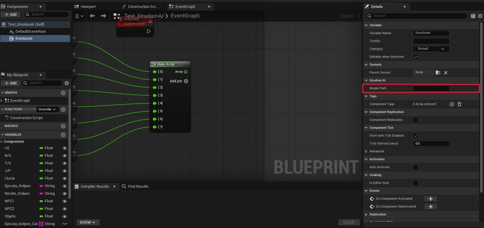
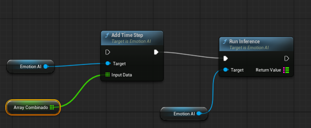
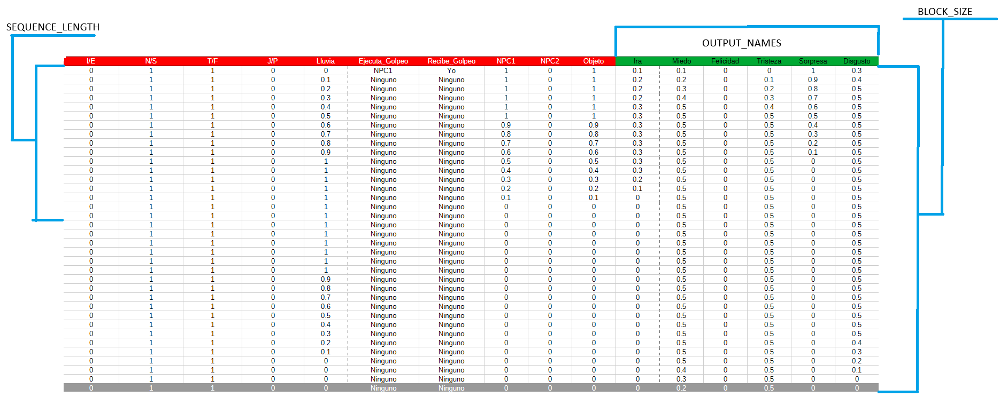

# GUÍA DE USUARIO
> **Documentación Técnica Integrada**
> Guía completa para el entrenamiento del modelo GRU de emociones y su posterior integración mediante plugin en Unreal Engine.

---

## Índice de Contenidos

1. [**Entrenamiento del modelo GRU de emociones**](#1-entrenamiento-del-modelo-gru-de-emociones)
   * 1.1 [Requisitos e Instalación](#11-requisitos-e-instalación)
   * 1.2 [Instrucciones de Uso](#12-instrucciones-de-uso)
2. [**Guía de instalación del Plugin en Unreal Engine**](#2-guía-de-instalación-del-plugin-en-unreal-engine)
   * 2.1 [Preparación del entorno y navegación](#21-preparación-del-entorno-y-navegación)
   * 2.2 [El personaje base (NPC)](#22-el-personaje-base-npc)
   * 2.3 [Configuración del Cerebro (Componente EmotionAI)](#23-configuración-del-cerebro-componente-emotionai)
   * 2.4 [Conexión con el sistema de animación](#24-conexión-con-el-sistema-de-animación)
   * 2.5 [Generación de acciones en el entorno](#25-generación-de-acciones-en-el-entorno)
   * 2.6 [Reacciones y árboles de estado (StateTrees)](#26-reacciones-y-árboles-de-estado-statetrees)
3. [**Ampliación de Información y Referencia Técnica**](#3-ampliación-de-información-y-referencia-técnica)
   * 3.1 [Configuración de parámetros (`config.ini`)](#31-configuración-de-parámetros-configini)
   * 3.2 [Referencia de Scripts de Ejecución](#32-referencia-de-scripts-de-ejecución)

---

# 1. Entrenamiento del modelo GRU de emociones 

## 1.1 Requisitos e Instalación 

Para inicializar el entorno de entrenamiento, es requisito indispensable tener instalado [Python](https://www.python.org/downloads/release/python-3144/).

**Pasos de instalación:**
1. Descargar el archivo comprimido del repositorio de GitHub y extraer su contenido en un directorio vacío.
2. Navegar a la ruta `TFG-Castellanos-Sanchez\GRU` y ejecutar el script `import_dependencies.bat`. Este proceso generará automáticamente un entorno virtual dentro de la carpeta `venv`.
3. Copiar el dataset (en formato `.csv` delimitado por comas) dentro del directorio `dataset`.

## 1.2 Instrucciones de Uso 

Una vez completada la instalación y generado el entorno virtual, proceda con los siguientes pasos desde el directorio `Castellanos-Moreno-Sanchez\GRU`:

1. Abra el archivo de configuración `config.ini`.
2. Cumplimente los datos requeridos en la sección **`[Dataset]`**.

El sistema permite dos modalidades de entrenamiento:
* **Entrenamiento Directo:** Ejecutando `gru_only.bat`.
* **Entrenamiento con Autoencoder (Aumento de datos):** Ejecutando `training.bat`. *(Existe una configuración por defecto en las secciones `[Autoencoder]` y `[GRU]` del `config.ini` que puede ser modificada según las necesidades del proyecto).*

> **Nota:** En ambas modalidades, el sistema aplicará automáticamente la codificación *One-Hot* a las entradas correspondientes a las columnas categóricas.

### Pruebas y Validación (Testeo)
Si desea validar el entrenamiento con nuevos datos empíricos:
1. Añada los nuevos datos en un archivo llamado `realset.csv` dentro del directorio `dataset`.
2. Ejecute el script `testeo.bat` (requiere haber generado previamente el modelo).
3. Tras la validación, el modelo generado se ubicará en la carpeta `models`, quedando listo para su integración en Unreal Engine.

---

# 2. Guía de instalación del Plugin en Unreal Engine 

**Paso previo:** Copie el modelo generado (ubicado en la carpeta `models`) dentro del directorio `Content` de su proyecto de Unreal Engine.

## 2.1 Preparación del entorno y navegación 

Para garantizar el correcto funcionamiento de la Inteligencia Artificial, el entorno debe soportar las acciones parametrizadas durante el entrenamiento.

* **Nivel de trabajo:** Puede crear un nivel nuevo o utilizar uno existente. La herramienta incluye un nivel preconfigurado de prueba: `Demo2`, localizado en `Content/TFG-Castellanos-Sanchez/Levels`.
* **Volumen de Navegación:** Es estrictamente necesario añadir un volumen de navegación para permitir el desplazamiento del NPC (patrullaje, huida, etc.). Desde el panel *Place Actors*, arrastre un `NavMesh Bounds Volume` a la escena y escálelo hasta cubrir toda la superficie transitable.

## 2.2 El personaje base (NPC) 

Se proporciona un actor preconfigurado (`DemoSandBoxCharacter_Mover`) ubicado en `Content/TFG_CastellanosSanchez/Blueprints/Npc`. Arrástrelo al nivel.

> **Personalización del NPC (MetaHuman)**
> Por defecto, el actor integra un MetaHuman y componentes de prueba. Debe personalizarlo asignando su propio MetaHuman modificando el *Skeletal Mesh* en el componente `VisualOverride`.
> 1. Para crear un modelo personalizado, consulte el [Video tutorial de MetaHuman Creator](https://youtu.be/2M22x-Jm4WE) (o utilice los modelos incluidos en el `.zip` de la carpeta Content).
> 2. Acceda al componente `Visual Override` del actor, localice el parámetro `Child Actor` y asigne el Blueprint de su MetaHuman.

## 2.3 Configuración del Cerebro (Componente EmotionAI) 

Para dotar al NPC de procesamiento emocional, añada el componente **`EmotionIA`** al Blueprint del personaje (ubicado en el `source` del proyecto). *Importante: Aplíquelo en el Blueprint, no como instancia en el nivel.*

En el panel de detalles del componente:
* Defina en **`Model Path`** la ruta y nombre del archivo de su modelo, utilizando la carpeta `Content` como raíz.

### Inferencias desde Blueprints
Dispone de un Actor Blueprint de ejemplo ya configurado en `Content/TFG-Castellanos-Sanchez/IA` llamado `Test_EmotionIA`. 
Utilice el nodo **`Run Inference`** dentro del Event Graph para realizar predicciones.

* **Entrada:** Un vector de floats (`Array<float>`) con los parámetros de entrada.
* **Salida:** Un vector de floats ordenado según el parámetro `OUTPUT_NAMES` del `config.ini`.

Para la conversión de valores categóricos, utilice el nodo **`One Hot Encode with Categories`** pasando como parámetros el *string* a codificar y un array con los valores posibles.

> **Formato de los datos para la Inferencia:**
> El vector debe contener primero los valores continuos/discretos y posteriormente los categóricos, respetando el orden del dataset.
> *Ejemplo:* > `[DiscretoA, DiscretoB, CategoricoA, DiscretoC, CategoricoB]` **➜** `[DiscretoA, DiscretoB, DiscretoC, CategoricoA_1...CategoricoA_X, CategoricoB_1...CategoricoB_X]`

## 2.4 Conexión con el sistema de animación 

Para reflejar físicamente las emociones procesadas:

1. Navegue a `Content/TFG_CastellanosSanchez/Blueprints/ExpresionFacial` e inserte el actor **`BP_AnimationSystem`** en el nivel.
2. Seleccione el actor, busque la variable **`Metahuman Actor`** en Detalles y asigne el NPC creado en el paso 2.2 mediante el cuentagotas.
3. Active la variable **`Use Emotion`** para habilitar la deformación facial en tiempo real.
4. Envíe el mapa de emociones (salida del nodo `Run Inference` del paso 2.3) al actor `BP_AnimationSystem`. A continuación se muestra un ejemplo de implementación:

*(Donde `Animation Actor` es una referencia a la instancia de `BP_AnimationSystem`)*.

## 2.5 Generación de acciones en el entorno 

La IA reacciona dinámicamente a los estímulos. Es responsabilidad del desarrollador programar las variables de entorno en el nivel para que sean coherentes con el dataset de entrenamiento.
*La demo incluida contiene ejemplos preconfigurados como precipitaciones (lluvia) o eventos de amenaza (jugador equipando un arma).*

## 2.6 Reacciones y árboles de estado (StateTrees) 

La traducción de emociones a comportamientos requiere el uso de StateTrees:

1. Verifique que el NPC está poseído por el controlador de IA designado: **`AIC_NPC_Demo`**.
2. Asigne un **State Tree** por parámetro a este controlador. Dispone de un ejemplo funcional en `Content/TFG_CastellanosSanchez/Blueprints/AI/StateTree` llamado `ST_NPC_Principal`.

> **Recomendación de Diseño:** Utilice el árbol base proporcionado (que incluye estados lógicos como *Sentirse amenazado, Caminar, Correr*) como **Linked Asset** dentro de sus propios StateTrees personalizados para optimizar tiempos de desarrollo.

---

# 3. Ampliación de Información y Referencia Técnica 

A continuación se detalla la documentación técnica avanzada sobre los parámetros de configuración y los scripts ejecutables.

## 3.1 Configuración de parámetros (`config.ini`) 

### Bloque `[Dataset]` (Obligatorio)
| Parámetro | Descripción |
| :--- | :--- |
| **`CSV_NAME`** | Nombre del archivo CSV que contiene el dataset de entrenamiento. |
| **`TESTER_CSV_NAME`** | Nombre del archivo CSV para validación (se recomiendan datos independientes). |
| **`OUTPUT_NAMES`** | Nombre de las columnas objetivo (emociones que el modelo debe predecir). |
| **`SEQUENCE_LENGTH`** | Longitud de la secuencia de entradas para el entrenamiento del GRU. |
| **`BLOCK_SIZE`** | Tamaño de las entradas contiguas dentro del dataset. |

### Bloque `[Autoencoder]`
| Parámetro | Descripción |
| :--- | :--- |
| **`N_SYNTHETIC`** | Número de secuencias sintéticas generadas por el autoencoder. |
| **`EPOCHS`** | Iteraciones totales para el entrenamiento del autoencoder. |
| **`LATENT_SIZE`** | Dimensión del espacio latente. |
| **`HIDDEN_SIZE`** | Tamaño de las capas ocultas. |
| **`HIDDEN_NUM`** | Cantidad de capas ocultas en la arquitectura. |
| **`LEARNING_RATE`** | Tasa de aprendizaje (Learning rate). |
| **`BETA_VAE`** | Valor del parámetro beta utilizado en la función de pérdida. |
| **`BATCH_SIZE`** | Tamaño del lote (Batch) de procesamiento. |
| **`USE_CUDA`** | *True* para cálculo en GPU (Recomendado) o *False* para CPU. |

### Bloque `[GRU]`
| Parámetro | Descripción |
| :--- | :--- |
| **`EPOCHS`** | Iteraciones totales para el entrenamiento del modelo GRU. |
| **`HIDDEN_SIZE`** | Tamaño de las capas ocultas del modelo. |
| **`NUM_LAYERS`** | Número total de capas ocultas. |
| **`BATCH_SIZE`** | Tamaño del lote (Batch) de procesamiento. |
| **`LEARNING_RATE`** | Tasa de aprendizaje (Learning rate). |
| **`ACCURACY_THRESHOLD`**| Rango de tolerancia para considerar válida una salida. |
| **`USE_CUDA`** | *True* para cálculo en GPU o *False* para CPU. |

 

## 3.2 Referencia de Scripts de Ejecución 

### `training.bat`
Script principal de pipeline para generación de datos y entrenamiento:
* Genera casos de prueba sintéticos a partir del dataset original.
* Aplica codificación *One-Hot* automáticamente a las columnas categóricas.
* Almacena los datos sintéticos como `generated_{nombre_dataset}`.
* Muestra un gráfico de dispersión en consola con la distribución de los nuevos datos.
* Entrena el modelo GRU y exporta los archivos necesarios para Unreal Engine (`gru_model.onnx` y `gru_model.onnx.data`) y un archivo `gru_model.pth` para testeos locales.

### `gru_only.bat`
Script para entrenamiento directo:
* Entrena el modelo utilizando exclusivamente los datos del dataset configurado, aplicando codificación *One-Hot*.
* Muestra por consola las matrices de confusión resultantes y el porcentaje de precisión (*Accuracy*) final del modelo.

### `testeo.bat`
Script de validación y auditoría:
* Carga el modelo `gru_model.pth` de la carpeta `models` y realiza predicciones usando el dataset de prueba indicado.
* Imprime por pantalla un análisis de correlación matemática entre las salidas reales del dataset de prueba y las inferidas por el modelo.
