# GUÍA DE USUARIO
> **Documentación Técnica Integrada**
> Guía completa para el entrenamiento del modelo GRU de emociones y su posterior integración mediante plugin en Unreal Engine.

---

## Índice de Contenidos

1. [**Entrenamiento del modelo GRU de emociones**](#1-entrenamiento-del-modelo-gru-de-emociones)
   * 1.1 [Requisitos e Instalación](#11-requisitos-e-instalación)
   * 1.2 [Instrucciones de Uso](#12-instrucciones-de-uso)
2. [**Guía de instalación del Plugin en Unreal Engine**](#2-guía-de-instalación-del-plugin-en-unreal-engine)
   * 2.1 [Preparación del entorno y navegación](#21-preparación-del-entorno-y-navegación)
   * 2.2 [El personaje base (NPC)](#22-el-personaje-base-npc)
   * 2.3 [Configuración del Cerebro (Componente EmotionAI)](#23-configuración-del-cerebro-componente-emotionai)
   * 2.4 [Conexión con el Cerebro (Componente `BPC_PsicologyNPC`)](#24-conexion-con-el-cerebro)
   * 2.5 [Conexión con el sistema de animación](#25-conexión-con-el-sistema-de-animación)
   * 2.6 [Interacción y Control del Entorno (Variables Dinámicas)](#26-interaccion-control-del-entorno)
   * 2.7 [Arquitectura de Comportamiento: StateTrees y Animaciones](#27-reacciones-y-árboles-de-estado-statetrees)
3. [**Ampliación de Información y Referencia Técnica**](#3-ampliación-de-información-y-referencia-técnica)
   * 3.1 [Configuración de parámetros (`config.ini`)](#31-configuración-de-parámetros-configini)
   * 3.2 [Referencia de Scripts de Ejecución](#32-referencia-de-scripts-de-ejecución)

---

# 1. Entrenamiento del modelo GRU de emociones 

## 1.1 Requisitos e Instalación 

Para inicializar el entorno de entrenamiento, es requisito indispensable tener instalado [Python](https://www.python.org/downloads/release/python-3144/).

**Pasos de instalación:**
1. Descargar el [archivo comprimido](https://github.com/narratech/TFG-Castellanos-Sanchez/releases/tag/GRU_Trainer) del repositorio de GitHub y extraer su contenido en un directorio vacío.
2. Abrir la carpeta descomprimida y ejecutar el script `import_dependencies.bat`. Este proceso generará automáticamente un entorno virtual dentro de la carpeta `venv`.
3. Copiar el dataset propio (en formato `.csv` delimitado por comas) dentro del directorio `dataset`.

## 1.2 Instrucciones de Uso 

Una vez completada la instalación y generado el entorno virtual, proceda con los siguientes pasos desde el directorio `GRU`:
> **Nota:** El fichero config.ini tiene unos valores predefinidos para el dataset proporcionado

> ⚠️ **Aviso:** No modifique los valores de los campos fuera de `[Dataset]` si no comprende completamente su función.
1. Abra el archivo de configuración `config.ini`.
2. Localize la seccion `[Dataset]`.
3. Rellene el campo `CSV_NAME` con el nombre del .csv dentro de la carpeta `dataset` con el que entrenará el modelo.
4. (Opcional) Rellene el campo `TESTER_CSV_NAME` con el nombre del .csv  dentro de la carpeta `dataset` con el que el modelo hará pruebas.
5. Rellene el campo `OUTPUT_NAMES` con los nombres de las columnas de salida del dataset separado por comas.
6. Rellene el campo `SEQUENCE_LENGTH` con la longitud de secuencia con la que entrenará el modelo.
7. Rellene el campo `BLOCK_SIZE` con longitud de entradas consecutivas en el tiempo dentro del dataset (Deben ser todos los bloques de la misma longitud).
8. Ajuste los campos de las otras secciones para afinar el entrenamiento si fuera necesario.

> **Nota:** `SEQUENCE_LENGTH` y `BLOCK_SIZE` pueden ser del mismo tamaño.

El sistema permite dos modalidades de entrenamiento:
* **Entrenamiento Directo:** Ejecutando [`GRU_only.bat`](#gruonly). 
* **Entrenamiento con Autoencoder (Aumento de datos):** Ejecutando [`Autoencoder_And_GRU.bat`](#autoencoderandgru). *(Existe una configuración por defecto en las secciones `[Autoencoder]` y `[GRU]` del `config.ini` que puede ser modificada según las necesidades del proyecto).*

> **Nota** Se recomiendo usar `GRU_only.bat` para el entrenamiento con el dataset que proporcionamos.

Tras el entrenamiento, el modelo generado se ubicará en la carpeta `models`, quedando listo para su integración en Unreal Engine.

> **Nota:** En ambas modalidades, el sistema aplicará automáticamente la codificación *One-Hot* a las entradas correspondientes a las columnas categóricas.

### Pruebas y Validación (Testeo)
Si desea validar el entrenamiento con nuevos datos empíricos:
1. Añada los nuevos datos en un archivo llamado `realset.csv` dentro del directorio `dataset`.
2. Ejecute el script [`Test.bat`](#testeo) (requiere haber generado previamente el modelo).
3. Hay mas información del entrenamiento y validación dentro de la carpeta `graphs`.

---

# 2. Guía de instalación del Plugin en Unreal Engine 
# 2.1 Instalación del Plugin en el proyecto 
Para poder contar con nuestro plugin en su proyecto creado de Unreal Engine, debera acceder al archivo .zip y descomprimirlo en una carpeta llamada `Plugins` en la raiz del proyecto de Unreal. Si dicha carpeta no está creada, creela. Una vez descomprimido abrá el proyecto y ya será visible desde el explorador de archivos del motor. 

> **Nota de Diseño:** Para facilitar las pruebas y la integración, esta guía se apoya en los sistemas preconstruidos utilizados en nuestra **Demo1**, del proyecto del repositorio. En lugar de programar la lógica desde cero, le guiaremos para implementar nuestras herramientas modulares. De esta forma, obtendrá una IA funcional de forma casi inmediata, comprendiendo en cada paso el funcionamiento interno del sistema.

**Paso previo:** Copie los archivos gru_model.onnx y gru_model.onnx.data (ubicado en la carpeta `models`) en cualquier lugar dentro del directorio `Content` de su proyecto de Unreal Engine.

## 2.2 Preparación del entorno y navegación 

Para garantizar el correcto funcionamiento de la Inteligencia Artificial, el entorno debe soportar las acciones parametrizadas durante el entrenamiento.

* **Nivel de trabajo:** Puede crear un nivel nuevo o utilizar uno existente. Recomendamos utilizar el nivel preconfigurado de prueba: `Demo2`, localizado en `Content/TFG-Castellanos-Sanchez/Levels`, en nuestro proyecto del repositorio, como toma de contacto. De esta forma será más rápido llegar a nuestro objetivo de crear un nivel parecido al de la `Demo1`.
* **Volumen de Navegación:** Es estrictamente necesario añadir un volumen de navegación para permitir el desplazamiento del NPC (patrullaje, huida, etc.). Desde el panel *Place Actors*, el cuál puedes encontrar yendo al barra de encima de la previsualización de la escena, seleccionando el icono de Añadir elementos al proyecto de forma rápida > Place Actors , arrastre un `NavMesh Bounds Volume` a la escena y escálelo hasta cubrir toda la superficie transitable. Una vez haya movido al NPC a la escena en el siguiente paso, al pulsar la tecla **P** podrá visualizar en verde las zonas navegables.

## 2.3 El personaje base (NPC) 

Se proporciona un actor preconfigurado (`DemoSandBoxCharacter_Mover`) ubicado en `Plugins/MBTI_Motion/Content/Blueprints/NPC`. Arrástrelo al nivel.

> **Personalización del NPC (MetaHuman)**
> Debe personalizarlo asignando su propio MetaHuman modificando el *Skeletal Mesh* en el componente `VisualOverride`: 
> 1. Para crear un modelo personalizado, consulte el [Video tutorial de MetaHuman Creator](https://youtu.be/2M22x-Jm4WE) (o utilice los modelos incluidos en el proyecto del repositorio en la carpeta Content/Metahuman, migrandolos así a su proyecto).
> 2. Acceda al componente `Visual Override` del actor, para ello seleccione dicho actor vaya al panel de detalles y acceda al componente mencionado, localice el parámetro `Child Actor Class` y asigne el Blueprint de su MetaHuman, si ha creado uno deberá buscar 'BP_[NombreDelMetahuman]', sino podrá buscar algunos de los modelos migrados como 'BP_Ada' o 'BP_Emanuel'.

## 2.4 Configuración del Cerebro (Componente EmotionAI) 

Para dotar al NPC de procesamiento emocional, utilize el componente de `EmotionAI`.
Dispone de un Actor Blueprint de ejemplo parcialmente configurado en `Content/TFG-Castellanos-Sanchez/IA` llamado `Test_EmotionIA`, de nuestro proyecto. El cuál podrá migrar y arrastrarlo a la escena, para luego abrir el blueprint. 

> **Nota:** Los pasos de esta seccion son en base a un modelo entrenado con el dataset proporcionado.

Dentro del componente debe rellenar la variable Model Path a la ruta que contenga el modelo exportado en nuestro projecto tomando Content como raiz, tambien es necesario poner el nombre del archivo junto con la extension .onnx (en este caso seria algo como [RUTA MODELO]/gru_model.onnx).

### Inferencias desde Blueprints
Antes de realizar la inferencia debe agrupar los datos y vectorizar los que no sean numeros.

Para ello, tome como ejemplo el Actor Blueprint `Test_EmotionIA` mencionado previamente y sigua una serie de pasos que resumiran el flujo de trabajo de este componente.

* **Agrupacion de dato numéricos:** Crea una variable de tipo *Array<float>* llamado `ArrayCombinado` y establece como valor inicial los valores numericos ya combinados dentro del EventGraph tal y como se ve en la imagen. Para luego conectar el flujo de ejecución al nodo `Inference` del tipo `Custom Event`.

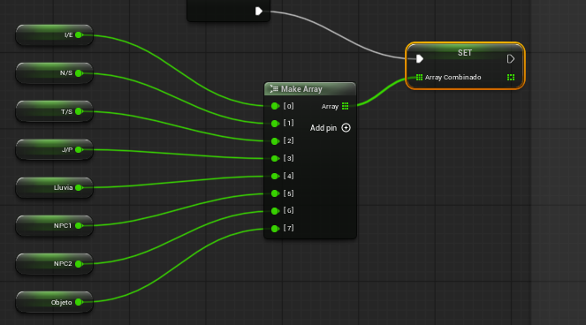

Con esto tendrá todos los valores numéricos ya agrupados dentro de nuestro array.
> **Nota:** Observe que el orden en el que aparecen los valores es el mismo que en el que aparecen dentro del dataset quitando los valores no numéricos.

> [!IMPORTANT]
> Sobre el origen de los datos: Tenga en cuenta que en este paso únicamente se está enseñando a configurar la estructura de entrada en el Blueprint del modelo de IA. Más adelante verás como sacamos y seteamos dichos valores. Pero en un entorno de juego real, usted será el responsable de programar la extracción de estos datos del entorno (por ejemplo: calcular la distancia al jugador, leer la vida actual del NPC o comprobar si es de día/noche) e inyectar ("setear") dichos valores dinámicos en las variables de este Blueprint justo antes de ejecutar la inferencia.

* **Añadir los valores no numéricos:** Recoge lo que hay en la variable *string* ya creada de `Ejecuta_Golpeo` y el *Array<string>* de `Ejecuta_Golpeo_Categories` y paselo al nodo `One Hot Encode with Categories`. La variable `Ejecuta_Golpeo_Categories` contiene todos los posible valores que puede tomar `Ejecuta_Golpeo` sin importar el orden ya que internamente se ordena alfabeticamente (en el entrenamiento tambien sigue esta regla).
A continuación, añada a la variable `ArrayCombinado` el array obtenido mediante un nodo `APPEND`.

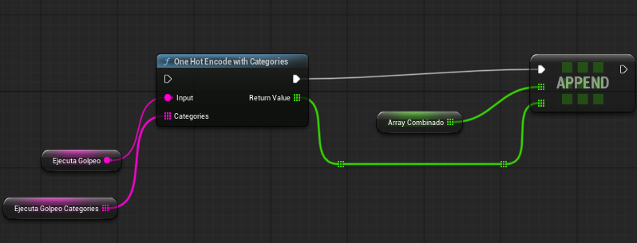

Volver a realizar el mismo proceso con las variables `Recibe_Golpeo` y `Recibe_Golpeo_Categories`.
> **Nota:**  Observe que el orden de `Ejecuta_Golpeo` y `Recibe_Golpeo` tambien coincide con el del dataset si no tenemos en cuenta los valores numericos.

Más adelante podrá ver una captura final de como quedan organizados los nodos y donde se deben conectar los cables del flujo de ejecución. 

* **Realizar la inferencia del modelo:** Use el nodo `Add Time Step` pasandole como parametro la variable `ArrayCombinado` y realize después una inferencia con `Run Inference`. El resultado de la inferencia será un diccionario de valores numericos que usarán como clave los nombres utilizados en `OUTPUT_NAMES` al entrenar el modelo.

> **Nota:** En lugar del nodo `Add Time Step` se puede usar el nodo `Change Time Step Table`, que en lugar de añadir un paso en el tiempo, permite establecer toda la tabla de pasos de tiempos (hay que asegurarse que la tabla es de tamaño Entradas * Sequencias).

Para concluir, termine de enlazar la salida de `Run Inference` con el nodo `SET` de la variable `Emociones`.

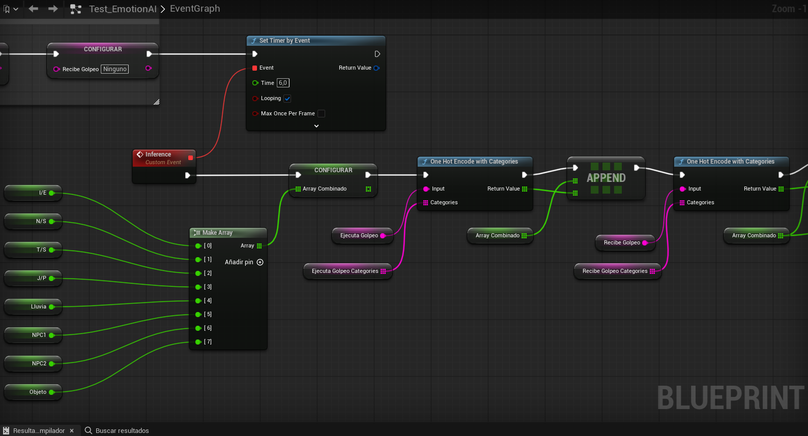

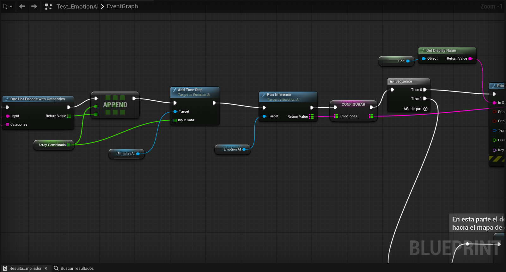

## 2.5 Conexión con el Cerebro (Componente `BPC_PsicologyNPC`) 

> **Recomendación de Diseño (Acelerador de Integración):** > En lugar de programar la memoria y los sensores de cada NPC desde cero, en nuestro proyecto del repositorio cuenta nuestro componente modular **`BPC_PsicologyNPC`**, pero este está adaptado e nuestra versión del modelo GRU. Este componente actúa como la "corteza prefrontal" del personaje: gestiona sus recuerdos, evalúa el entorno periódicamente y procesa quién golpea a quién, enviando los datos limpios al modelo GRU. Es un requerimiento clave para que los comportamientos avanzados de la demo funcionen sin configuraciones extra.

Para poder usarlo acceda a la carpeta `Content/TFG-Castellanos-Sanchez/Blueprints/Components`, y migre dicho componente a su proyecto. 
Para implementarselo al actor del NPC, simplemente abra el Blueprint de su personaje (ej. `DemoSandBoxCharacter_Mover`), haga clic en *Add Component* y añada **`BPC_PsicologyNPC`**.

### 2.5.1 Variables Expuestas (Configuración en Editor)
Una vez añadido el componente, selecciónelo para ver su panel de Detalles. Encontrará una serie de variables públicas que debe configurar directamente en el editor del nivel para cada NPC instanciado:

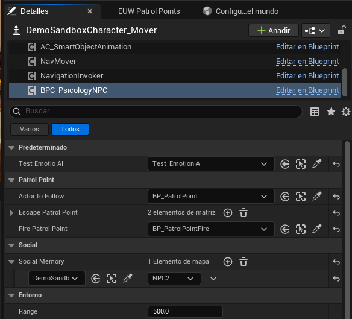

* **Categoría *Predeterminado***
  * **`Test Emotio AI`:** Referencia directa al actor `Test_EmotionIA` de la escena, el cual contiene la red neuronal GRU encargada de calcular la inferencia.
* **Categoría *Patrol Point***
  * **`Actor To Follow`:** El actor o punto de ruta inicial hacia el que el NPC debe dirigirse al empezar la simulación. Más adelante se explicará que se debe instanciar aquí.
  * **`Escape Patrol Point` (Array):** Una lista de *Target Points* distribuidos por el mapa que el NPC utilizará como refugios aleatorios cuando el GRU detecte un nivel alto de miedo. Al igual que antes más adelante se explicará como instanciar dichos puntos. 
  * **`Fire Patrol Point`:** Una ubicación segura predefinida relacionada con el clima (por ejemplo, una chimenea) a la que el NPC acudirá si la temperatura es desfavorable. Lo mismo que con las dos anteriores variables. 
* **Categoría *Social***
  * **`Social Memory` (Diccionario / Map):** ¡Vital para la interacción! Es un mapa que relaciona *Actores* reales del nivel con nuestro *Enum* `E_SocialRole` (Ej: El jugador = "Jugador", Otro NPC = "NPC1"). El componente utiliza esta memoria para saber a quién está viendo. En nuestro proyecto no hace falta hacer nada ya que al iniciar el nivel se instancian los valores según el rol escogido al jugar.
    *  **⚠️ Implementación en tu proyecto:** Para que el NPC reconozca a otros actores, **debes rellenar este diccionario por código o Blueprints** (usando el nodo `Add` de Mapas) pasándole la referencia del actor y el rol que quieras asignarle.
    * *💡 Ejemplo de arquitectura (Cómo lo hacemos en nuestra Demo):* Nosotros utilizamos un `Game Instance` para guardar el rol elegido por el jugador en el menú principal. Luego, al cargar la escena, utilizamos el *Construction Script* o el *BeginPlay* del Blueprint del Nivel para recuperar ese rol y hacer un `Add` en la `Social Memory` de cada NPC, registrando al jugador. Puedes replicar este sistema o crear tu propio "Manager" que registre estas relaciones al inicio de la partida. 
* **Categoría *Entorno***
  * **`Range`:** El radio de visión y consciencia del NPC (en unidades de Unreal).

### 2.5.2 Funcionamiento Interno (¿Qué hace este componente por usted?)

Si decide investigar el Blueprint por dentro, verá que hemos optimizado la arquitectura siguiendo estándares de la industria AAA:

**1. Optimización del Rendimiento (Behavior Tick)**
En lugar de saturar la CPU evaluando distancias en cada fotograma (`Event Tick`), el componente inicializa un **Timer** en el `Begin Play` que se ejecuta cada 0.3 segundos (`ServerBehaviourTick`). Solo si el NPC puede actuar (`CanTakeAction`), procederá a recalcular las distancias a otros NPCs y evaluar a su objetivo actual. Esto permite tener múltiples NPCs en pantalla manteniendo un rendimiento óptimo.

**2. Sistema de Memoria de Navegación (`SetActorToFollow`)**
Cuenta con una lógica robusta para interrumpir rutas. Cuando surge una emergencia (ej. huir de un disparo), el evento `SetActorToFollow` recibe el nuevo punto de escape, pero permite guardar el destino original en la variable **`Old Actor To Follow`**. Cuando la emergencia termina, el NPC recuperará este dato y continuará su rutina exactamente por donde la dejó.

**3. Testigo de Combate y Roles Sociales (`OnWitnessAttack`)**
Es el sistema más avanzado del componente. Si ocurre una pelea en el radio de visión del NPC, este evento recibe quién es el Agresor y quién es la Víctima. 
El código busca a estos actores dentro de su **`Social Memory`** (el diccionario que usted configuró). Al identificar sus roles (por ejemplo, si descubre que la víctima es "Yo" o es un "Aliado"), mapea inmediatamente estos roles en las variables `Rol Agresor` y `Rol Victima` y dispara una actualización directa al Cerebro Emocional (`Set Roles Emotion AI`). El modelo GRU procesará este evento al instante, alterando drásticamente el estado emocional del NPC hacia el miedo o la ira.

## 2.6 Conexión con el sistema de animación 

Para reflejar físicamente las emociones procesadas:

1. Navegue a `Plugins/MBTI_Motion/Content/Blueprints/AnimationSystem` e inserte el actor **`BP_AnimationSystem`** en el nivel.
   
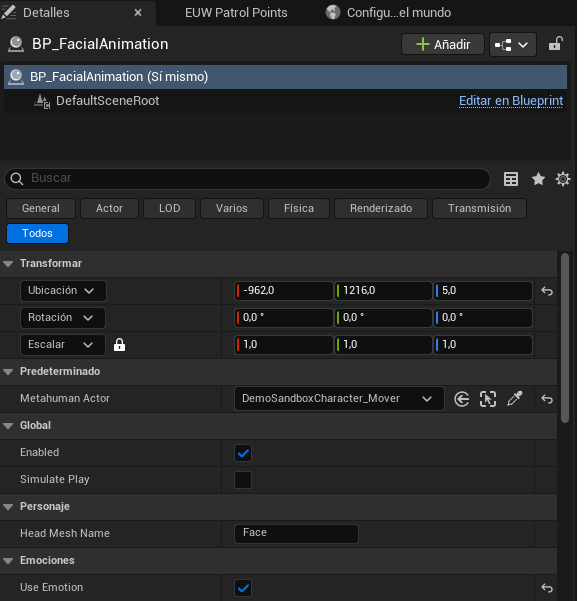

2. Seleccione el actor, busque la variable **`Metahuman Actor`** en Detalles y asigne el NPC creado en el paso 2.2 mediante el cuentagotas.
3. Active la variable **`Use Emotion`** para habilitar la deformación facial en tiempo real.
4. Envíe el mapa de emociones (salida del nodo `Run Inference` del paso 2.3) al actor `BP_AnimationSystem`. A continuación se muestra un ejemplo de implementación:

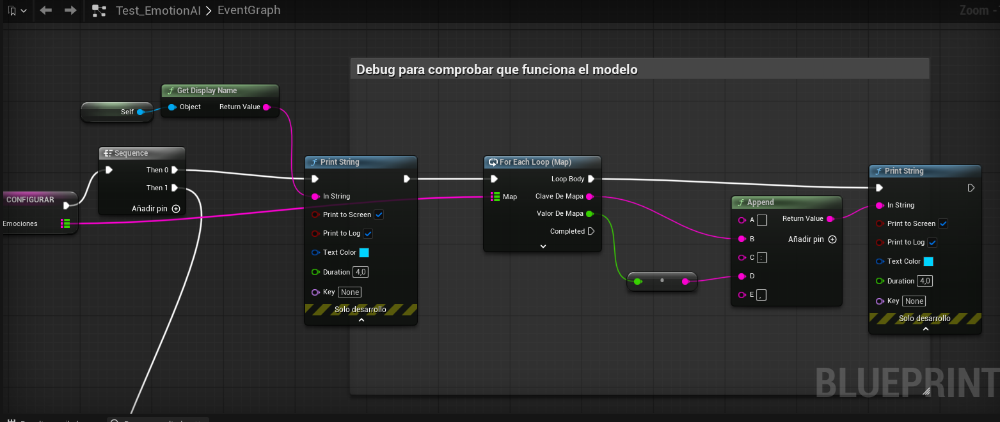

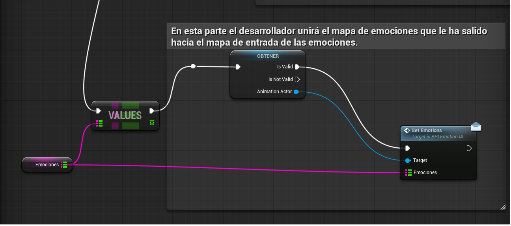

> [!IMPORTANT]
> Ahora para que funciones todo, debe volver al componente creado en el paso 2.3, o si ha usado el componente `Test_EmotionAI` acceda al panel de detalles y verá una variable llamada `Animation Actor`, en la que debera asignaar la referencia a la instancia de `BP_AnimationSystem`

## 2.7 Interacción y Control del Entorno (Variables Dinámicas) 

La IA reacciona dinámicamente a los estímulos. Para facilitar las pruebas, hemos incluido, en nuestro proyecto del repositorio, sistemas preconfigurados que actúan como "disparadores" para las emociones del NPC:

### Gestor Climático (`BP_WeatherManager`)

Este Blueprint global controla el clima del nivel. Accediendo a `Content/TFG-Castellanos-Sanchez/Blueprints/Managers`, podrá migrarlo y arrástrelo a su escena.
* **¿Qué hace?** Modifica visualmente el entorno (nubes, lluvia, iluminación) y sirve de referencia global para todos los NPCs.

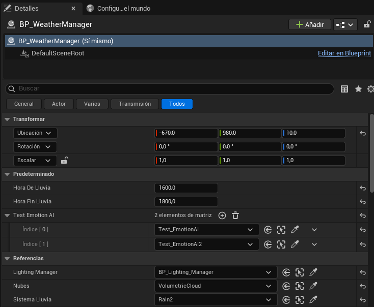

* **Variables Clave:**
  * Hora de Lluvia: indicar la hora a la que quiere que empiece a llover, los tiempos van de 0 a 2400 (por ejemplo las 16 seria el valor 1600)
  * Hora Fin LLuvia: indicar la hora a la que se termine la lluvia.
  * Test Emotion AI: Indicar los Test Emotion AI de los NPC para saber la intensidad de la lluvia en todo momento.
  * Lighting Manager: será necesario migrarlo desde nuestro proyecto y arrastrarlo a la escena el `BP_Lighting_Manager`, ubicado en `PWL_Light_Manager/Blueprint`, en este Blueprint será interesante configurar la hora en la que empezará la escena, de esta forma cuando más cerca del inicio de la lluvia pues antes lloverá. Para ello seleccione dicho actor en la jerarquia, vata al panel de detalles, y busque el apartado de 'General Settings'. Encontrará un parámetro que llamado 'Sun Height (Time of day)' que indica la hora del día.  
  * Nubes: otro actor interesante de la escena es el `VolumetricCloud`de esta forma será mas realista el efecto. 
  * Sistema LLuvia: es neceario agregarle el particle system de la lluvia llamado `Rain`, Dicho particle system ya está agregado en la escena simplemente habrá que buscarlo e instanciarlo en el parámetro.
  * `Esta Lloviendo` (Booleano): Al activarse durante la ejecución, los Evaluadores de la IA detectan el cambio de clima y el GRU ajusta las emociones, obligando al NPC a buscar refugio o calentarse.
  
### Objetos Interactuables (Ej. El Arma / Pistola)

Dentro de la demo encontrará objetos interactuables diseñados para alterar el comportamiento del NPC.
* **Uso del Arma:** Si dicha arma ha sido migrada a su proyecto, el jugador deberá arrastra el arma de la ruta `Content/TFG-Castellanos-Sanchez/Blueprints/Interactables` a cualquier parte accesible de la escena, luego durante el juego podrá interactuar con el arma (pulsando la tecla `E` para recogerla/equiparla). Al hacer clic en la E, se equipará y el arma apuntará.
* **Impacto en la IA:** El NPC cuenta con conos de visión. Si el jugador entra en su campo de visión con el arma equipada, el estado de amenaza (`IsReaction`) se vuelve verdadero. El modelo GRU procesará un aumento drástico del miedo, lo que obligará al NPC a interrumpir sus tareas y huir al punto de escape más lejano.

## 2.8 Arquitectura de Comportamiento: StateTrees y Animaciones 

El puente entre las emociones predichas por el GRU y las acciones físicas del personaje se gestiona mediante un **State Tree**. 

Asigne el controlador de IA proporcionado (**`AIC_NPC_Demo`**) a su NPC. Para ello acceda al panel de detalles del actor `DemoSandBoxCharacter_Mover`, y verá una variable llamada `AIController`, asigne el controlador antes mencionado en esta variable. Este controlador utiliza el árbol principal **`ST_NPC_Principal`** (ubicado en `Content/TFG_CastellanosSanchez/Blueprints/AI/StateTree`).

### 2.8.1 Estructura del `ST_NPC_Principal`
Para que el árbol de comportamientos funcione sin necesidad de escribir código visual (Blueprints), se apoya en tres pilares fundamentales que puede ver en el panel de Detalles del `ST_NPC_Principal`: **Contexto, Parámetros y Evaluadores**.

**1. El Contexto (Context)**
Define sobre "quién" se está ejecutando el árbol. Automáticamente, toma como referencia el **Actor** (el NPC) y su **AIController**. Estas referencias globales se inyectan hacia abajo, permitiendo que cualquier Tarea o Evaluador sepa exactamente a qué NPC está controlando.

**2. Parámetros del Árbol (Parameters)**
Son variables internas que actúan como la memoria a corto plazo de la IA. Por ejemplo:
* `RangeToEscapePistol` *(Float)*: La distancia (ej. 200.0) a la que el NPC considera que la pistola está lo suficientemente lejos como para sentirse a salvo, o huir o reaccionar de cerca.
* `Out_ReactionSequence` *(Booleano)*: Guarda si la secuencia de animaciones del data asset se quiere ejecutar en secuencia (true) o si solo se quiere ejecutar una animación random de la secuencia (false)
* `HasPlayedIntroReaction` *(Booleano)*: Una memoria para evitar que el NPC repita la animación inicial de, por ejemplo "susto", si el jugador no deja de apuntarle.

**3. Los Evaluadores (Sensores de la IA)**
Los evaluadores son el "sistema nervioso" del NPC. Se ejecutan en cada fotograma (*On Tick*) en el estado Raíz (*Root*), procesando el entorno y devolviendo variables de salida (`Salida` u `Output`) que el árbol utiliza para tomar decisiones instantáneas. Nuestra demo incluye:

* **`STE_CombatMonitor` (Prioridad 1 - Impactos):**
    * *Qué hace:* Se comunica con el componente de psicología.
    * *Variables de Salida:* `Out_GetHit` (¿Me han pegado?), `Out_SomeoneWasHit` (¿Han pegado a alguien cerca?), `Out_FrontHit` (¿El golpe viene de frente?). 
    * *Uso en la Jerarquía:* El primer estado del árbol lee `Si STE_CombatMonitor.Out_GetHit es True`. Si ocurre, bloquea el resto del árbol y fuerza la animación de impacto.
* **`STE_PlayerThreatMonitor` (Prioridad 2 - Amenazas):**
    * *Qué hace:* Vigila si el jugador está apuntando con un arma. Recibe como *Entrada* el parámetro `RangeToEscapePistol`.
    * *Variables de Salida:* `Out_IsReaction` (El jugador apunta), `Out_ShouldRun` (Está demasiado cerca, toca correr).
    * *Uso en la Jerarquía:* Si no hay combates, el árbol lee este evaluador. Si `Out_IsReaction` es *True*, transiciona al estado de huida si la pistola esta lejos o al estado de reacción si está muy cerca.
* **`STE_WeatherMonitor` (Prioridad 3 - Clima):**
    * *Qué hace:* Verifica el `BP_WeatherManager` y lanza un rayo virtual hacia arriba para saber si el NPC está a cubierto.
    * *Variables de Salida:* `Out_IsRaining` (¿Llueve?), `Out_IsOutside` (¿Estoy en la calle?).
    * *Uso en la Jerarquía:* Permite derivar al NPC hacia la casa o hacia una chimenea.
* **`STE_GetPatrolDetails` (Prioridad 4 - Rutina):**
    * * *Qué hace:* Lee el sistema de patrullas del nivel.
    * *Variables de Salida:* `Out_CurrentPatrolPoint` (Punto al que debo ir ahora).

### 2.8.2 Modularidad: Linked Assets (Sub-Árboles)
Nuestra arquitectura es altamente modular. La lógica de combate y clima está encapsulada en **Linked Assets**. 
* **Aplicación Práctica:** Si usted crea su propio *State Tree* desde cero para un NPC diferente, no necesita reprogramar cómo huir de las armas. Simplemente arrastre nuestro estado "Linked Asset" a su árbol, y su nuevo NPC heredará automáticamente todas nuestras reacciones de supervivencia y análisis del GRU.

**El Flujo de Variables Hacia el Linked Asset:**
Un Linked Asset funciona como una "Caja Negra" a la que hay que inyectarle datos desde el árbol padre. Tomando como ejemplo nuestro Sub-árbol de Reacciones (`ST_NPC_Reactions`), este requiere recibir por parámetro las siguientes variables:

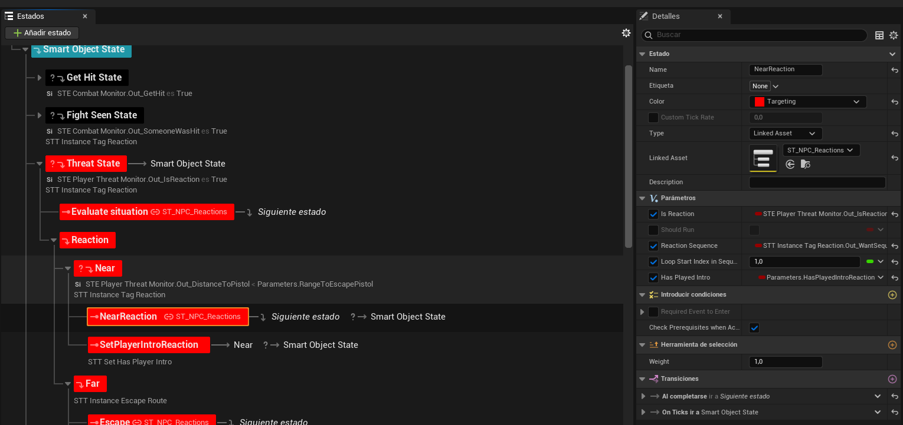

* **`bIsReaction` (Booleano):** Determina si existe una amenaza visual que requiera una reacción estática.
* **`bShouldRun` (Booleano):** Determina si la amenaza es tan crítica que el NPC debe huir.
* **`ReactionSequence` (Booleano):** Le dice al sub-árbol si quiere realizar el diccionario de animaciones en secuencia o coger una animación al azar.
* **`LoopStartIndexInSequence` (Entero) y `HasPlayedIntro` (Booleano):** Si se ha elegido que se va a realizar el diccionario de animaciones en secuencia, es posible que en dicha secuencia no se quiera repetir la animación inicial, ya sea porque es un susto y solo quieres que se haga la primera vez. Para ello es necesario pasar un entero para ver a partir de que animación realizas el bucle de la secuencia, y poner el booleano a true para saber que la animación incial ya se ha ejecutado una vez y quieres partir del indice establecido en `LoopStartIndexInSequence`.

**Jerarquía Interna del Linked Asset:**

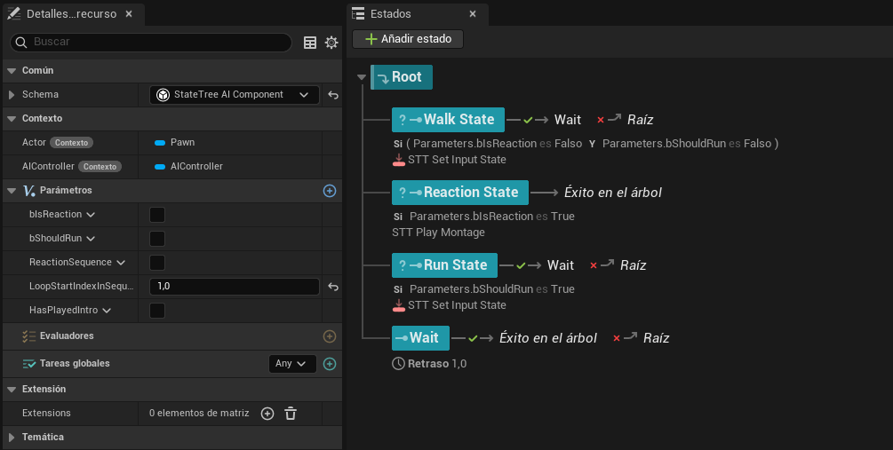

Una vez inyectados estos parámetros, el Sub-árbol elige internamente qué hacer evaluando dichas condiciones:
1.  **`Run State`:** Se ejecuta inmediatamente `Si Parameters.bShouldRun es True`.
2.  **`Reaction State`:** Se ejecuta `Si Parameters.bIsReaction es True` (y la anterior fue falsa). Llama a la tarea interna de reproducir las animaciones alimentándola con las tags recibidas.
3.  **`Walk State` / `Wait`:** Si ambas condiciones booleanas son falsas, el NPC asume que el peligro ha pasado, procediendo a calmarse o caminar según corresponda, devolviendo finalmente el "Éxito en el árbol" para retornar al árbol principal.ia.

### 2.8.3 Sistema de Patrullas Dinámicas (`BP_PatrolPoint`)

Para dotar al nivel de vida, el NPC necesita moverse de forma autónoma cuando no está reaccionando a un estímulo emocional. En lugar de programar coordenadas fijas en el código, hemos implementado en nuestro proyecto un sistema utilizando el actor **`BP_PatrolPoint`**.

Este sistema permite al diseñador de niveles crear rutas complejas de forma visual directamente en el editor.

**1. ¿Qué es el `BP_PatrolPoint`?**
Es un Blueprint muy ligero que actúa como una baliza o destino. Contiene lógica interna para decirle al NPC hacia dónde debe ir después y cuánto tiempo debe descansar al llegar.

**2. Cómo crear un circuito de patrulla en su nivel:**
> **Nota:** Debe comprobar si dichas carpetas que se van a mencionar están migradas en su proyecto.

* Vaya a la carpeta `Content/TFG-CastellanosSanchez/Editor`y abra el archivo `EUW_PatrolPoints` y para ejecutar un Editor Utility Widget hay que hacer clic sobre "Run Editor Utility Widget", esto abrirá una ventana para ir creando PatrolPoints a partir del seleccionado.
* Vaya a la carpeta `Content/TFG_CastellanosSanchez/Blueprints/AI` y arrastre un **`BP_PatrolPoint`** a su escena.
* Seleccione el **PatrolPoint**. En su pantalla abierta del `EUW_PatrolPoints`, dale a **`Next Patrol Point`** y verá que se crea otro punto, muevelo hacia donde quiera que vaya el NPC.
* Existe la opción de darle al boton de  **`Between Patrol Point`**, para ello deberá seleccionar un punto A y un punto C, creandose así un punto B. Por lo tanto el recorrido seria A -> B -> C y C -> B -> A
* Si quiere cerrar el circuito y crear un bucle infinito, en el Punto C seleccione de nuevo el Punto A.

* En el punto 2.4.1 Variables Expuestas (Configuración en Editor) en las variables relacionadas con Patrol Points deciamos que más tarde se explicaría que instanciar. Pues ahora que sabemos que es un patrol point y como se crean en la escena, se recomienda poner varios puntos para la lista de Escape Patrol Points donde se crea que son buenos puntos de huida, como puede ser fuera de la casa. Una vez puestos se deberán instanciar en el editor en las variables de dicho apartado. Lo mismo haremos con el Fire Patrol Point, que sera el punto de la chimenea. En el caso de Actor to Follow se asignara el punto inicial de cada ruta creada, tiene que ser el primer puntos si o si. 

**3. Personalización del comportamiento por punto:**

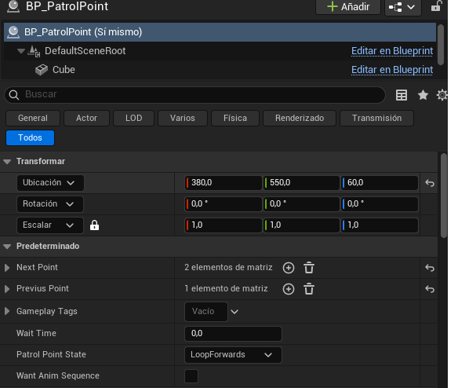

En el panel de detalles de cada `BP_PatrolPoint` encontrará variables adicionales (como `WaitTime` o *Tiempo de espera*). Esto le permite crear un comportamiento orgánico: puede hacer que el NPC llegue a un punto y espere 5 segundos, pero que al llegar a otro punto continúe caminando inmediatamente (espera = 0). También hay una varibale de Gameplay Tag, para asignar las animaciones que realizarán al llegar a dicho punto. Por último encontrará la variable `Want Anim Sequence` que si se activa hará que la secuencia de animaciones correspodiente a dicho Patrol Point se realice una detras de otra en vez de elegir solo una animación random de la lista. 

### 2.8.4 Modularidad Animada: Gameplay Tags y Data Assets

Uno de los mayores errores en el desarrollo de IA es "hardcodear" (fijar directamente en el código) las animaciones. Si le decimos al State Tree *"Reproduce la animación de huir de Pedro"*, ese State Tree ya no servirá para "María", porque intentará usar el esqueleto de Pedro.

Para resolver esto y hacer que nuestra IA sea escalable, la demo utiliza una arquitectura basada en **Gameplay Tags** y **Data Assets**. Esto permite que un único State Tree gobierne a infinitos NPCs, y que cada uno se anime con su propio estilo.

**1. Las Etiquetas (Gameplay Tags)**
Una *Gameplay Tag* es simplemente una etiqueta jerárquica (texto) que el motor reconoce globalmente. En lugar de decir "Reproduce Animación X", el State Tree ordena: *"Ejecuta la acción asociada a la etiqueta `Anim.Reaction.Scared`"*.

* *¿Cómo usarlo?* Si abre el Sub-árbol `ST_NPC_Reactions`, ubicado en `Content/TFG-Castellanos-Sanchez/Blueprints/AI/StateTree/SubStateTree` y vas al estado de `Reaction State` veras que la tarea `STT_PlayMontage`, es capaz de acceder a un data asset si el Gameplay Tag actual del NPC coincide con algun data asset contenido en la lista del NPC. Para establecer el Gameplay Tag actual al NPC tiene dos formas: usando una tarea en un estado anterior llamada `STT_InstanceTagReaction`, como puedes ver en nuestro arbol  `ST_NPC_Principal` hay un estado como `Threat State` que instacia el Gameplay Tag actual a `NPC.Reactions.ReactFlinch` de esta forma el Play Montage reproducirá las animaciones del data assets vinculado con ese tag. Otra forma es que acceda al Gameplay Tag del Patrol Point en el que esta ubicado y haga alguna animación en ese momento.

**2. El Diccionario de Animaciones (Data Assets)**

Para que el NPC sepa qué animación física corresponde a esa etiqueta, utilizamos un **Data Asset**. Funciona como un diccionario de traducción personal de cada personaje.
* En el directorio del proyecto, encontrará Data Assets creados en `Content/TFG-Castellanos-Sanchez/Blueprints/NPCs/DataAssets` a partir de una clase personalizada que vemos en `TFG-Castellanos-Sanchez/Blueprints/PrimaryDataAssets`.
* Si abre uno de estos Data Assets, verá:
  * **Clave (Key):** El Gameplay Tag (ej. `Anim.Reactions.Random`) con el se comparará en el `STT_PlayMontage` si tiene dicho data asset el NPC .
  * **Lista de Montage:** *Animations Montages* físicos que se reproducirán en el juego.

**3. Implementación para el usuario:**
Si usted quiere añadir nuevas animaciones o crear un NPC completamente nuevo con nuestro sistema, siga estos pasos:

1. **Crear su Diccionario:** Haga clic derecho en el Content Browser > *Miscellaneous* > *Data Asset*. Seleccione la clase de mapeo de animaciones que proporcionamos, 'PDA_Animation'.
2. **Llenar el Diccionario:** Abra su nuevo Data Asset y añada tantas filas como necesite. Asigne una etiqueta (ej. `Anim.Reactions.Idle`) y añada en la lista *Animations Montages* de su propio personaje.
3. **Equipar al Cerebro:** Vaya al Blueprint de su nuevo NPC. Seleccione su componente principal de comportamiento o variables y busque la ranura para el Data Asset de animación. Asigne ahí el archivo que acaba de crear.

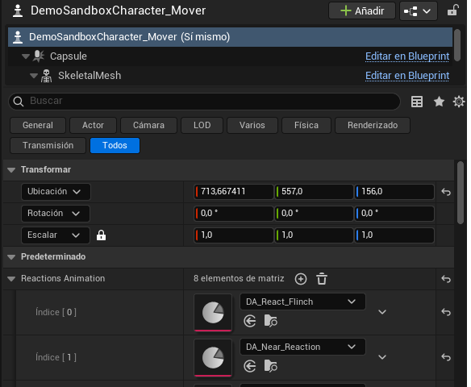

**El resultado del flujo es instantáneo:** El State Tree dicta la lógica universal (Ej. "Has recibido un golpe, ejecuta la etiqueta `Anim.Hit`"). El NPC recibe la orden, consulta **su propio Data Asset**, encuentra la animación de dolor específica para su cuerpo, y la reproduce. No tendrá que reprogramar ni un solo nodo para añadir decenas de personajes distintos al juego.
---

# 3. Ampliación de Información y Referencia Técnica 

A continuación se detalla la documentación técnica avanzada sobre los parámetros de configuración y los scripts ejecutables.

## 3.1 Configuración de parámetros (`config.ini`) 

### Bloque `[Dataset]` (Obligatorio)
| Parámetro | Descripción |
| :--- | :--- |
| **`CSV_NAME`** | Nombre del archivo CSV que contiene el dataset de entrenamiento. |
| **`TESTER_CSV_NAME`** | Nombre del archivo CSV para validación (se recomiendan datos independientes). |
| **`OUTPUT_NAMES`** | Nombre de las columnas objetivo (emociones que el modelo debe predecir). |
| **`SEQUENCE_LENGTH`** | Longitud de la secuencia de entradas para el entrenamiento del GRU. |
| **`BLOCK_SIZE`** | Tamaño de las entradas contiguas dentro del dataset. |

### Bloque `[Autoencoder]`
| Parámetro | Descripción |
| :--- | :--- |
| **`N_SYNTHETIC`** | Número de secuencias sintéticas generadas por el autoencoder. |
| **`EPOCHS`** | Iteraciones totales para el entrenamiento del autoencoder. |
| **`LATENT_SIZE`** | Dimensión del espacio latente. |
| **`HIDDEN_SIZE`** | Tamaño de las capas ocultas. |
| **`HIDDEN_NUM`** | Cantidad de capas ocultas en la arquitectura. |
| **`LEARNING_RATE`** | Tasa de aprendizaje (Learning rate). |
| **`BETA_VAE`** | Valor del parámetro beta utilizado en la función de pérdida. |
| **`BATCH_SIZE`** | Tamaño del lote (Batch) de procesamiento. |
| **`USE_CUDA`** | *True* para cálculo en GPU (Recomendado) o *False* para CPU. |

### Bloque `[GRU]`
| Parámetro | Descripción |
| :--- | :--- |
| **`EPOCHS`** | Iteraciones totales para el entrenamiento del modelo GRU. |
| **`HIDDEN_SIZE`** | Tamaño de las capas ocultas del modelo. |
| **`NUM_LAYERS`** | Número total de capas ocultas. |
| **`BATCH_SIZE`** | Tamaño del lote (Batch) de procesamiento. |
| **`LEARNING_RATE`** | Tasa de aprendizaje (Learning rate). |
| **`ACCURACY_THRESHOLD`**| Rango de tolerancia para considerar válida una salida. |
| **`USE_CUDA`** | *True* para cálculo en GPU o *False* para CPU. |

 

## 3.2 Referencia de Scripts de Ejecución 

### `Autoencoder_And_GRU.bat`  
Script principal de pipeline para generación de datos y entrenamiento:
* Genera casos de prueba sintéticos a partir del dataset original.
* Aplica codificación *One-Hot* automáticamente a las columnas categóricas.
* Almacena los datos sintéticos como `generated_{nombre_dataset}`.
* Muestra un gráfico de dispersión en consola con la distribución de los nuevos datos.
* Entrena el modelo GRU y exporta los archivos necesarios para Unreal Engine (`gru_model.onnx` y `gru_model.onnx.data`) y un archivo `gru_model.pth` para testeos locales.

### `GRU_only.bat`  
Script para entrenamiento directo:
* Entrena el modelo utilizando exclusivamente los datos del dataset configurado, aplicando codificación *One-Hot*.
* Muestra por consola las matrices de confusión resultantes y el porcentaje de precisión (*Accuracy*) final del modelo.

### `Test.bat`  
Script de validación y auditoría:
* Carga el modelo `gru_model.pth` de la carpeta `models` y realiza predicciones usando el dataset de prueba indicado.
* Imprime por pantalla un análisis de correlación matemática entre las salidas reales del dataset de prueba y las inferidas por el modelo.
